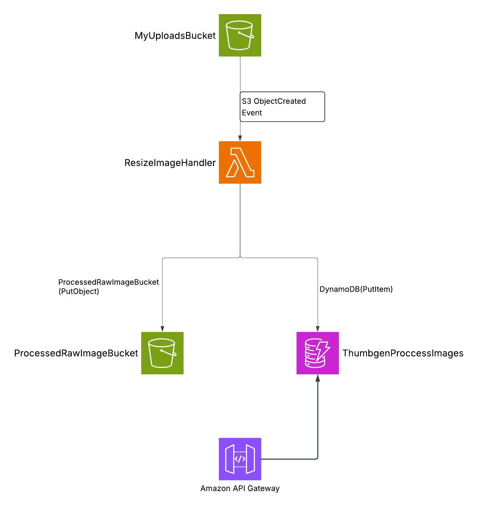

# aws-sam-image-resizer

Event-driven image thumbnail service on AWS, defined end to end as infrastructure
as code with AWS SAM. Uploading an image to S3 triggers a Lambda function that
generates a thumbnail, stores it in a separate bucket and records the metadata in
DynamoDB. A REST API exposes the results, returning short-lived presigned URLs
rather than making the bucket public.


---

## Architecture

<p align="center">
  
</p>

```text
WRITE PATH                                      READ PATH

   upload                                          client
     │                                               │ GET /thumbnails
     ▼                                               ▼
┌──────────────┐                            ┌──────────────────┐
│ uploads (S3) │                            │  API Gateway     │
└──────┬───────┘                            └────────┬─────────┘
       │ s3:ObjectCreated:*                          │
       ▼                                             ▼
┌─────────────────────┐                   ┌──────────────────────┐
│ ResizeImageHandler  │                   │ ListThumbnailsHandler│
└──────┬──────────────┘                   └──────────┬───────────┘
       │                                             │ Query ByCreatedAt
   ┌───┴────────────┐                                │
   ▼ PutObject      ▼ PutItem                        ▼
┌──────────────┐  ┌──────────────────┐     ┌──────────────────┐
│ outputs (S3) │  │ ThumbnailsTable  │ ◄───┤ ThumbnailsTable  │
└──────────────┘  └──────────────────┘     └──────────────────┘
```

The two paths are independent. Processing failures never affect reads, and API
traffic never slows down processing.

---

## Design decisions

**Two buckets, not one.** The thumbnail is written to a separate bucket rather
than back into the source. Writing into the triggering bucket would re-fire the
same `ObjectCreated` event and create an infinite invocation loop — a common and
expensive mistake in event-driven pipelines. Separate buckets make the loop
structurally impossible instead of relying on a prefix filter that someone can
later remove.

**DynamoDB alongside S3.** S3 holds the bytes; DynamoDB holds the metadata. This
makes results queryable — listing recent thumbnails is a range query rather than
a bucket listing, which does not scale and cannot be sorted by time.

**Presigned URLs instead of a public bucket.** The outputs bucket stays private.
The API returns time-limited URLs generated per request, so access can be revoked
by expiry and is never permanent. Making the bucket public would have been one
line of configuration — and would have meant every thumbnail ever generated is
world-readable forever.

**Scoped IAM, not managed policies.** Each function receives only the SAM policy
templates it needs. The resize function can read the uploads bucket and write to
the outputs bucket — not the reverse. The list function has read-only access to
one table and cannot write anything at all.

**A Lambda layer for shared dependencies.** Image libraries are large. Keeping
them in `layers/common` keeps the function packages small, speeds up deployment,
and versions the dependency set independently of the handler code.

**On-demand DynamoDB billing.** `PAY_PER_REQUEST` suits a workload that is idle
most of the time — no provisioned capacity to pay for or to tune.

**Structured logging from the start.** `LogFormat: JSON` is set in `Globals`, so
every function inherits it and CloudWatch Logs Insights can query fields directly
instead of parsing text with regular expressions.

---

## API reference

Base URL is printed in the stack outputs after deployment.

### `GET /thumbnails`

Returns the most recent thumbnails, newest first.

| Parameter | Type | Default | Description |
|---|---|---|---|
| `limit` | integer | 20 | Number of items to return |
| `next` | string | — | Pagination cursor from a previous response |

```json
{
  "items": [
    {
      "id": "9f2c1b7e-4a3d-4f8e-9c21-7b6a0d5e3f11",
      "sourceKey": "photos/beach.jpg",
      "thumbnailKey": "photos/beach_128.jpg",
      "width": 128,
      "height": 128,
      "sizeBytes": 8421,
      "createdAt": "2026-10-03T09:14:22Z",
      "url": "https://...s3...X-Amz-Expires=300..."
    }
  ],
  "next": "eyJpZCI6ICI5ZjJjMWI3ZSJ9"
}
```

### `GET /thumbnails/{id}`

Returns a single record by its identifier, or `404` if it does not exist.

**On the `url` field:** it is generated per request and expires in five minutes.
It is deliberately not stored in DynamoDB — a persisted URL would either expire
and become useless, or never expire and defeat the point of a private bucket.

---

## Data model

| Element | Attribute | Type | Purpose |
|---|---|---|---|
| Partition key | `id` | String | Unique identifier per processed image |
| GSI `ByCreatedAt` — PK | `entityType` | String | Groups records of the same kind |
| GSI `ByCreatedAt` — SK | `createdAt` | String | Sorts by creation time |

The table is keyed by `id` for direct lookups by the detail endpoint.

The `ByCreatedAt` index exists because the list endpoint asks a question a
key-value store cannot answer efficiently: "the most recent items". Partitioning
the index on a constant `entityType` and sorting on an ISO-8601 `createdAt` turns
that into a single backwards range query — one request, no scan, cost
proportional to the page size rather than to the table.

ISO-8601 is used for timestamps specifically because it sorts lexicographically
in the same order it sorts chronologically, which is what lets DynamoDB range
queries work on it directly.

---

## Repository layout

```text
.
├── resize_image/            Lambda handler — S3 event → thumbnail
├── list_thumbnails/         Lambda handler — API → DynamoDB query
├── layers/common/           Shared dependencies, published as a Lambda layer
├── events/                  Sample event payloads for local invocation
├── tests/
│   ├── unit/                No AWS account required
│   └── integration/         Run against a deployed stack
├── docs/architecture.png
├── template.yaml            All AWS resources
└── samconfig.toml           Deployment parameters
```

---

## Resources created by the stack

| Logical ID | Type | Notes |
|---|---|---|
| `MyUploadsBucket` | S3 bucket | `{stack}-uploads-{region}` — source of the trigger |
| `ProcessedRawImageBucket` | S3 bucket | `{stack}-outputs-{region}` — private |
| `ThumbnailsTable` | DynamoDB table | On-demand, with the `ByCreatedAt` GSI |
| `CommonLayer` | Lambda layer | Shared Python dependencies |
| `ResizeImageHandler` | Lambda function | Triggered by `s3:ObjectCreated:*` |
| `ListThumbnailsHandler` | Lambda function | Backs the REST API |
| `ThumbnailsApi` | API Gateway | Public read endpoints |

### Function configuration

| Variable | Used by | Purpose |
|---|---|---|
| `THUMBNAIL_SIZE` | resize | Target edge length in pixels |
| `OUTPUT_BUCKET` | resize, list | Destination bucket / presigned URL source |
| `TABLE_NAME` | resize, list | DynamoDB table |

Every value is resolved from the stack at deploy time, so no bucket or table name
is hard-coded in the source. The same template deploys to any account or region
without edits.

---

## Getting started

### Prerequisites

- [AWS SAM CLI](https://docs.aws.amazon.com/serverless-application-model/latest/developerguide/install-sam-cli.html)
- Python 3.14
- Docker — used by `sam build --use-container`
- AWS credentials with permission to create the resources above

### Deploy

```bash
sam build --use-container
sam deploy --guided
```

`--guided` prompts for stack name and region on the first run and saves the
answers to `samconfig.toml`; after that, `sam deploy` is enough.

`--use-container` builds dependencies inside a container matching the Lambda
runtime. Without it, native extensions compiled on macOS or Windows fail at
runtime on Lambda's Amazon Linux — a failure that only appears after deployment.

### Try it

```bash
# bucket names and the API URL are printed in the stack outputs
aws s3 cp sample.jpg s3://<stack-name>-uploads-<region>/

# the thumbnail appears in the outputs bucket
aws s3 ls s3://<stack-name>-outputs-<region>/

# and the API returns it
curl "<api-url>/thumbnails?limit=5"
```

---

## Local development

```bash
# invoke the resize handler against a recorded S3 event
sam local invoke ResizeImageHandler --event events/s3-put.json

# run the API locally on port 3000
sam local start-api
curl "http://localhost:3000/thumbnails?limit=5"
```

Both commands run the functions in containers that mirror the Lambda runtime,
which catches packaging and dependency problems before they reach AWS.

---

## Testing

```bash
pip install -r tests/requirements.txt

# unit tests — no AWS account needed
python -m pytest tests/unit -v

# integration tests — against a deployed stack
AWS_SAM_STACK_NAME="aws-sam-image-resizer" python -m pytest tests/integration -v
```

Unit tests cover the resize logic and the DynamoDB record shape in isolation.
Integration tests upload a real object and assert that the thumbnail and the API
response appear — verifying the event wiring and IAM permissions, which unit
tests cannot reach.

---

## Observability

Set once in `Globals`, inherited by every function:

```yaml
LoggingConfig:
  LogFormat: JSON
  ApplicationLogLevel: INFO
  SystemLogLevel: INFO
```

```bash
sam logs -n ResizeImageHandler --stack-name aws-sam-image-resizer --tail
```

Because the logs are JSON rather than plain text, CloudWatch Logs Insights can
filter on fields directly:

```sql
fields @timestamp, @message
| filter level = "ERROR"
| sort @timestamp desc
```

---

## Security notes

| Concern | How it is handled |
|---|---|
| Public data exposure | Both buckets are private; access is only through presigned URLs that expire |
| Over-broad permissions | Per-function IAM scoped to specific buckets and one table |
| Invocation loops | Output written to a different bucket than the trigger source |
| Credentials in code | None — every resource reference is resolved from the stack at deploy time |

---

## Cost

Everything here is pay-per-use, and the stack costs nothing while idle:

| Service | Model |
|---|---|
| Lambda | Per request and per GB-second of execution |
| S3 | Per GB stored and per request |
| DynamoDB | On-demand — per read and write unit |
| API Gateway | Per million requests |

---

## Cleanup

```bash
# buckets must be emptied first — CloudFormation will not delete a non-empty bucket
aws s3 rm s3://<stack-name>-uploads-<region>/ --recursive
aws s3 rm s3://<stack-name>-outputs-<region>/ --recursive

sam delete --stack-name aws-sam-image-resizer
```

---

## Status

- [x] Infrastructure as code — all resources in `template.yaml`
- [x] S3-triggered resize pipeline
- [x] DynamoDB metadata with the `ByCreatedAt` index
- [x] Shared dependency layer
- [x] Unit and integration tests
- [ ] REST API — list and detail endpoints
- [ ] Presigned URL generation
- [ ] CI/CD with GitHub Actions

## Roadmap

- **CI/CD** — `sam build` and `sam deploy` on merge to `main`
- **Dead-letter queue** — capture invocations that fail after retries instead of
  losing them silently
- **Presigned upload URLs** — let clients upload directly to S3 without
  credentials
- **CloudWatch alarms** — on function errors and throttling
- **Multiple thumbnail sizes** — generated in one invocation

---

## License

MIT
